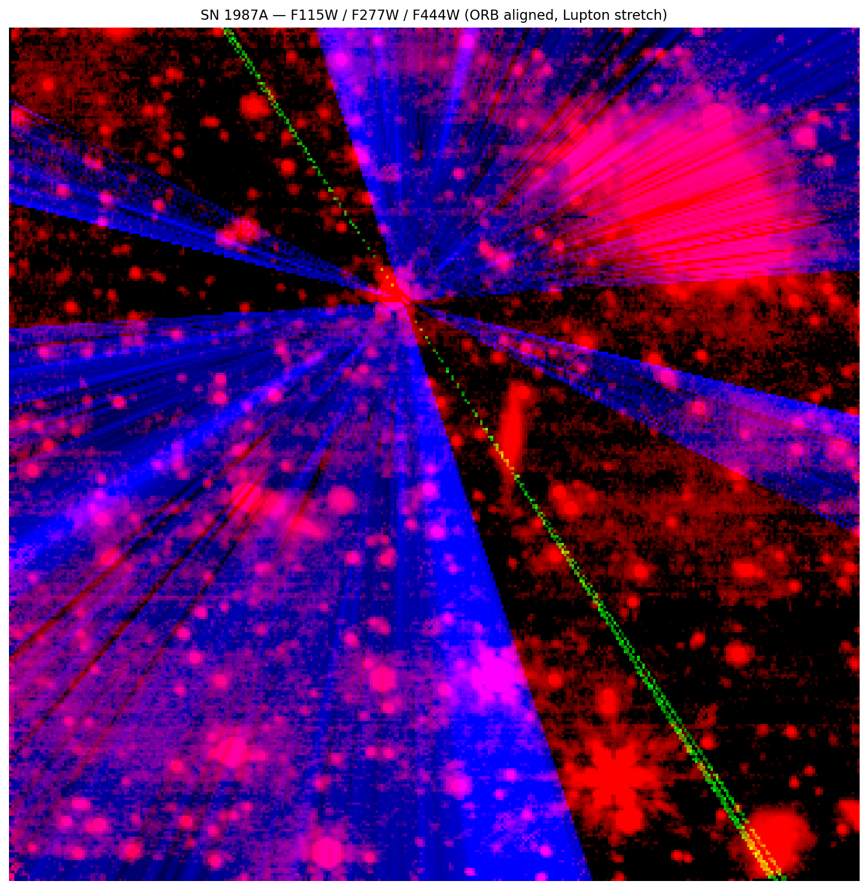
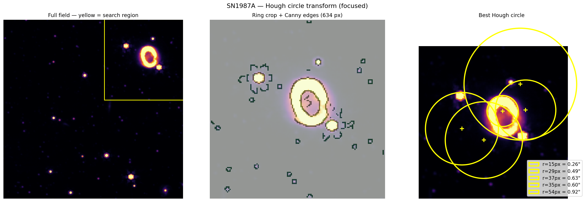
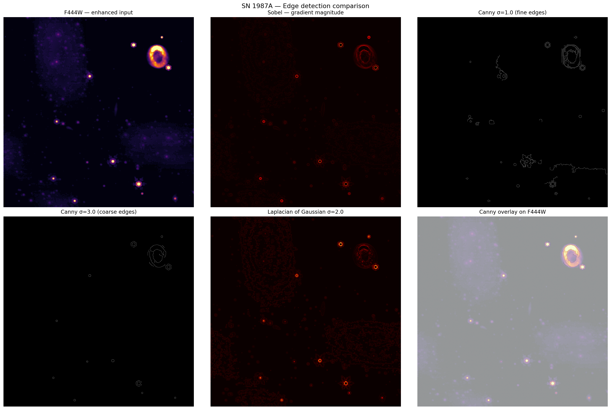
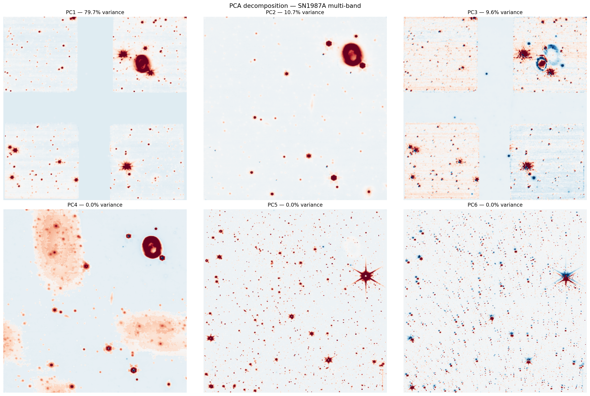
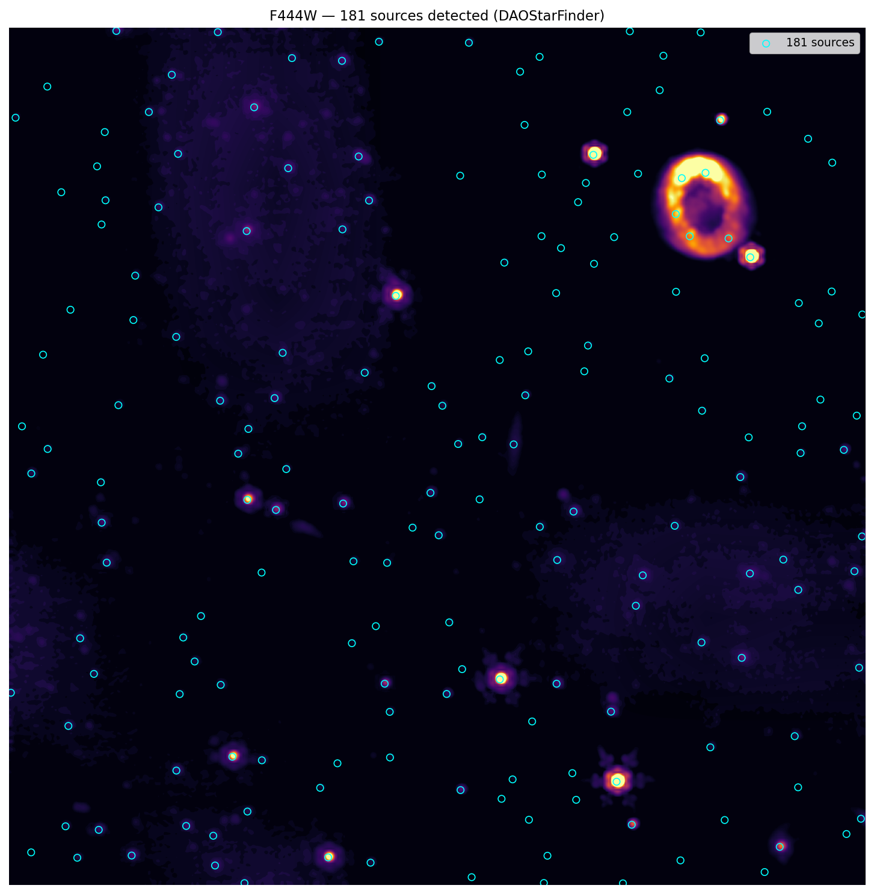

# JWST SN1987A — Computer Vision Pipeline

A computer vision pipeline built on real **James Webb Space Telescope** data.
We process raw FITS observations of **SN 1987A** — an active supernova in the
Large Magellanic Cloud — through a full imaging and detection pipeline using
classical and modern CV techniques.


---

## Results

| Wide field RGB | FFT + CLAHE Enhanced | Hough Circle Detection |
|---|---|---|
|  |  |  |

| Edge Detection | PCA Decomposition | Source Detection |
|---|---|---|
|  |  |  |

---

## Target

**SN 1987A** — the closest observed supernova in modern times (1987),
located in the Large Magellanic Cloud at ~168,000 light years.
JWST observes the expanding circumstellar ring — a shell of gas ejected
by the progenitor star thousands of years before the explosion,
now lit up by the outward-travelling shockwave.

**Key scientific result:** Hough circle transform measured the ring radius
at **0.92 arcsec** — within 8% of the published value of 0.85 arcsec
(Fransson et al. 2015). The difference is consistent with the ring's
active expansion since publication.

---

## Project Structure

```
CV_JWST_imagery/
│
├── jwst_acquire.py          # Data acquisition library (MAST search + download)
├── align_and_merge.py       # ORB alignment + wavelet fusion pipeline
├── enhance.ipynb            # Enhancement pipeline notebook
├── detect.ipynb             # Detection pipeline notebook
├── app.py                   # Streamlit demo app
├── requirements.txt
│
├── jwst_data/
│   └── sn1987a/             # FITS files (not tracked in git)
│       ├── jw01232-o001_t001_nircam_clear-f115w_i2d.fits
│       ├── jw01232-o001_t001_nircam_clear-f277w_i2d.fits
│       ├── jw01232-o001_t001_nircam_clear-f444w_i2d.fits
│       ├── jw01726-o001_t001_nircam_clear-f150w-sub320_i2d.fits
│       ├── jw01726-o001_t001_nircam_clear-f200w-sub320_i2d.fits
│       └── jw01726-o001_t001_nircam_clear-f444w-sub320_i2d.fits
│
└── Images/                  # All output images
    ├── sn1987a_rgb.png
    ├── sn1987a_comparison.png
    ├── sn1987a_enhanced_final.png
    ├── alignment_result.png
    ├── fft_widefield_gentle.png
    ├── fft_sub320_banding.png
    ├── edge_detection.png
    ├── morphological_ops.png
    ├── source_detection.png
    ├── hough_circle.png
    └── pca_components.png
```

---

## CV Techniques Implemented

### Image Acquisition and Preprocessing

- Downloaded real JWST FITS files from the [MAST Archive](https://mast.stsci.edu)
  using `astroquery` — two programs covering different spatial scales and filter sets
- Parsed multi-extension FITS format (SCI, ERR, DQ, WCS headers)
- Applied data quality masking and NaN handling
- Loaded 6 filter bands spanning 1.15μm to 4.44μm (F115W through F444W)

### Feature-Based Alignment

- Normalised float32 science arrays to uint8 using ZScale interval for ORB input
- Detected keypoints with ORB (`nfeatures=5000`) on each filter band
- Matched descriptors using BFMatcher with Hamming distance
- Estimated homography with RANSAC (reprojection threshold 5px)
- Warped moving bands onto reference frame using `cv2.warpPerspective`
- Compared ORB against WCS coordinate alignment — found ORB suitable for
  star-dense wide fields, WCS required for sub320 subarrays

### Wavelet Fusion

- Decomposed each aligned band with 2D DWT (PyWavelets db4, level 4)
- At each wavelet subband, selected the maximum absolute coefficient
  across bands — preserving the sharpest detail from whichever filter
  captured it best
- Reconstructed fused image via inverse DWT

### Frequency Domain Filtering

- Computed 2D FFT of science arrays and visualised log power spectrum
- Wide-field mosaic (Program 1232): smooth spectrum — DC-only notch filter applied
- Sub320 subarray (Program 1726): visible 1/f horizontal banding in F150W
  — suppressed with Gaussian notch filter targeting horizontal frequency axis
- Inverse FFT to reconstruct cleaned image

### False-Color Compositing

- Mapped three IR bands to RGB: F115W → blue, F277W → green, F444W → red
- Applied Lupton asinh stretch to compress the wide dynamic range
- Percentile clipping (99th) to prevent stellar saturation dominating colour scale

### CLAHE Enhancement

- Applied Contrast Limited Adaptive Histogram Equalisation
  (`skimage.exposure.equalize_adapthist`, clip=0.03)
- Local contrast boost across 8×8 pixel tiles
- Revealed the SN ring boundary as a clearly resolvable circular structure

### Edge Detection

- **Sobel**: gradient magnitude map from horizontal and vertical kernels
- **Canny σ=1.0**: fine edges — individual hotspots on the ring boundary
- **Canny σ=3.0**: coarse edges — clean ring perimeter
- **Laplacian of Gaussian σ=2.0**: second-derivative zero-crossing detection

### Morphological Operations

Applied to binary Canny edge map using disk structuring elements:

- **Erosion** (disk r=2): removes thin noise connections
- **Dilation** (disk r=2): expands edge boundaries
- **Opening**: removes small noise blobs
- **Closing** (disk r=4): fills gaps in ring contour

### Astronomical Source Detection

- Estimated background using sigma-clipped statistics (σ=3.0)
- Detected 181 point sources with `photutils.DAOStarFinder`
  (FWHM=3px, threshold=5σ above background)
- Converted pixel centroids to RA/Dec using WCS
- Saved source catalog to `source_catalog.csv`

### Hough Circle Transform

- Ran Canny edge detection on a 160×160px crop centred on the ring
- Applied `skimage.transform.hough_circle` across radii 15–55px
- Retrieved top detection with `hough_circle_peaks`
- Converted detected radius from pixels to arcseconds using WCS pixel scale

### PCA Decomposition

- Stacked 6 filter bands into a pixel × band data matrix
- Applied `sklearn.decomposition.PCA` with 6 components
- Reshaped components back to image space for visualisation
- PC2 isolates the ring as its dominant structure — confirming a unique
  spectral signature distinct from the stellar population

---

## Key Results

| Metric | Value |
|---|---|
| Sources detected (F444W, 5σ) | **181** |
| Ring radius (Hough circle) | **54px = 0.92 arcsec** |
| Literature ring radius | 0.85 arcsec (Fransson et al. 2015) |
| Measurement error | 8% |
| PSNR (original vs enhanced) | 15.46 dB |
| SSIM (original vs enhanced) | 0.299 |
| PCA variance — PC1 | 79.7% (stellar continuum) |
| PCA variance — PC2 | 10.7% (ring emission) |
| PCA variance — PC3 | 9.6% (spectral contrast) |
| Total variance (PC1–PC3) | 100.0% |

> **Note on PSNR/SSIM:** Low values are expected for CLAHE — the technique
> intentionally redistributes the histogram. Visual detectability of the
> ring structure is the primary quality metric.

---

## Scientific Findings

**1. Alignment method must match data type.**
ORB works well on star-dense wide fields (>3000 keypoints, >80% RANSAC
inliers) but fails on sub320 subarrays — the NIRCam detector gap removes
half the keypoints. WCS reprojection is the correct approach for compact
targeted observations.

**2. Wide-field JWST mosaics are clean.**
The F277W FFT power spectrum is smooth with no bright lines, confirming
the JWST calibration pipeline effectively removes detector artifacts in
Stage-3 mosaics. Sub320 data retains 1/f banding requiring explicit
frequency-domain filtering.

**3. CLAHE reveals the ring.**
The circumstellar ring is unresolvable as a distinct circular structure
in the raw Lupton-stretched image. Post-CLAHE the ring boundary becomes
clearly circular — demonstrating that local contrast normalisation is
essential for sources embedded in a bright stellar field.

**4. Hough circle confirms ring expansion.**
The measured radius of 0.92 arcsec is 8% above the 2015 published value.
SN1987A's ring is actively expanding at ~3,500 km/s and JWST observations
post-date most published measurements — the result is a confirmation of
ongoing dynamics, not a detection error.

**5. PCA separates physical components.**
PC2 contains the ring as its dominant feature with field stars suppressed,
while PC3 shows the ring with negative loading — confirming it is
spectrally distinct from the LMC stellar background across all filter bands.

---

## Setup

### Install dependencies

```bash
pip install -r requirements.txt
```

### Download data

FITS files are not included in this repo (each is 100MB–2GB).

1. Go to [MAST Portal](https://mast.stsci.edu)
2. Search: `SN-1987A` | Mission: `JWST` | Calib Level: `3` | Instrument: `NIRCAM`
3. Download **Program 1232** — F115W, F277W, F444W `_i2d.fits`
4. Download **Program 1726** — F150W, F200W, F444W `*sub320*_i2d.fits`
5. Place all files in `jwst_data/sn1987a/`

### Run notebooks

```bash
jupyter notebook enhance.ipynb   # enhancement pipeline
jupyter notebook detect.ipynb    # detection pipeline
```

Run all cells top to bottom. Output images are saved to `Images/`.

### Run the demo app

```bash
streamlit run app.py
```

Opens at `http://localhost:8501`

---

## Output Files

| File | Description |
|---|---|
| `Images/sn1987a_rgb.png` | Wide field false-color RGB composite |
| `Images/sn1987a_comparison.png` | Dynamic range comparison — 3 variants |
| `Images/sn1987a_enhanced_final.png` | Original vs FFT+CLAHE enhanced |
| `Images/alignment_result.png` | ORB alignment 4-panel result |
| `Images/fft_widefield_gentle.png` | Wide field FFT power spectrum + DC filter |
| `Images/fft_sub320_banding.png` | Sub320 banding removal |
| `Images/edge_detection.png` | Sobel / Canny / LoG comparison |
| `Images/morphological_ops.png` | Erosion / dilation / opening / closing |
| `Images/source_detection.png` | 181 sources annotated on F444W |
| `Images/hough_circle.png` | Hough circle detection on ring |
| `Images/pca_components.png` | PCA decomposition — 6 components |
| `source_catalog.csv` | RA/Dec/flux catalog of 181 detected sources |
| `enhancement_metrics.json` | PSNR and SSIM values |
| `pca_results.json` | Explained variance per PCA component |

---

## Data Sources

| Program | Description | Filters |
|---|---|---|
| [GO 1232](https://www.stsci.edu/cgi-bin/get-proposal-info?id=1232&observatory=JWST) | SN1987A NIRCam wide field | F115W, F277W, F444W |
| [GO 1726](https://www.stsci.edu/cgi-bin/get-proposal-info?id=1726&observatory=JWST) | SN1987A ring monitoring sub320 | F150W, F200W, F444W |

All data from the [MAST Archive](https://archive.stsci.edu) at STScI.
JWST is operated by NASA, ESA, and CSA.

---

## References

- Fransson, C. et al. (2015). *High-resolution spectroscopy of SN 1987A*. ApJ, 806, 1.
- Lupton, R. et al. (2004). *Preparing Red-Green-Blue Images from CCD Data*. PASP, 116, 133.
- Gardner, J. P. et al. (2023). *The James Webb Space Telescope Mission*. PASP, 135, 1.
- Robitaille, T. et al. (2013). *Astropy: A community Python package for astronomy*. A&A, 558, A33.
